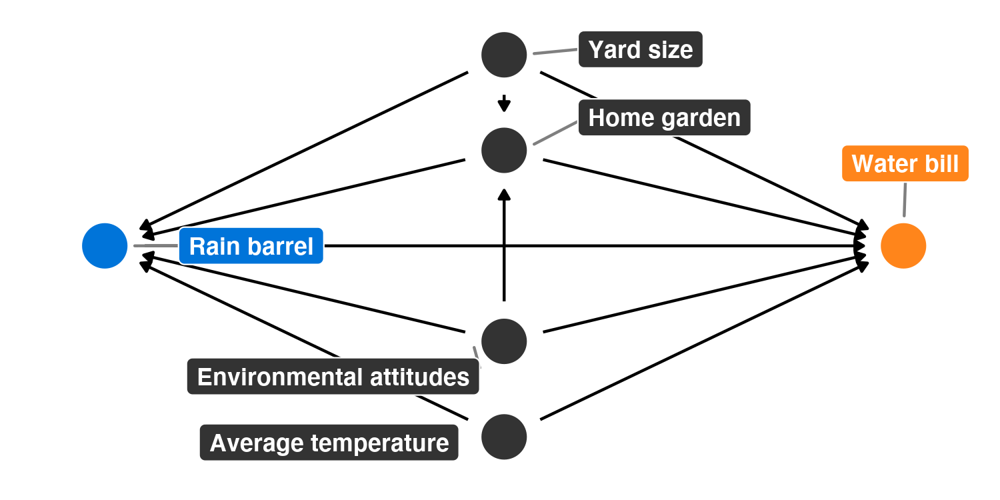
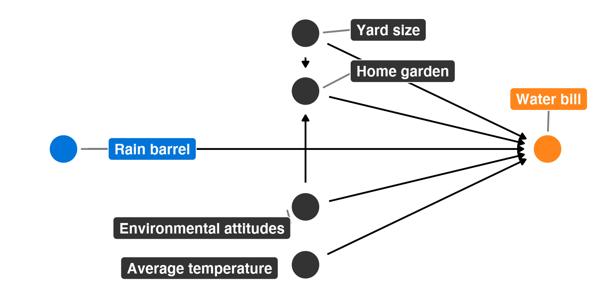

------------------------------------------------------------------------

# Program overview

The metropolitan Atlanta area is interested in helping residents become more environmentally conscious, reduce their water consumption, and save money on their monthly water bills. To do this, Fulton, DeKalb, Gwinnett, Cobb, and Clayton counties have jointly initiated a new program that provides free rain barrels to families who request them. These barrels collect rain water, and the reclaimed water can be used for non-potable purposes (like watering lawns and gardens). Officials hope that families that use the barrels will rely more on rain water and will subsequently use fewer county water resources, thus saving both the families and the counties money.

Being evaluation-minded, the counties hired an evaluator (you!) before rolling out their program. You convinced them to fund and run a randomized controlled trial (RCT) during 2018, and the counties rolled out the program city-wide in 2019. You have two datasets: `barrels_rct.csv` with data from the RCT, and `barrels_obs.csv` with observational data from self-selected participants.

These datasets contain the following variables:

-   `id`: A unique ID number for each household
-   `water_bill`: The family's average monthly water bill, in dollars
-   `barrel`: An indicator variable showing if the family participated in the program
-   `barrel_num`: A 0/1 numeric version of `barrel`
-   `yard_size`: The size of the family's yard, in square feet
-   `home_garden`: An indicator variable showing if the family has a home garden
-   `home_garden_num`: A 0/1 numeric version of `home_garden`
-   `attitude_env`: The family's self-reported attitude toward the environment, on a scale of 1-10 (10 meaning highest regard for the environment)
-   `temperature`: The average outside temperature (these get wildly unrealistic for the Atlanta area; just go with it)

# Your goal

Your task in this problem set is to analyse these two datasets to find the causal effect (or average treatment effect (ATE)) of this hypothetical program.

As a reference, Figure 1 shows the DAG for the program:



------------------------------------------------------------------------

```{r setup, warning=FALSE, message=FALSE}
install.packages("MatchIt", method = "wininet")

library(tidyverse)
library(broom)
library(patchwork)
library(MatchIt)

barrels_rct <- read_csv("data/barrels_rct.csv") %>% 
  # This makes it so "No barrel" is the reference category
  mutate(barrel = fct_relevel(barrel, "No barrel"))

barrels_obs <- read_csv("data/barrels_observational.csv") %>% 
  # This makes it so "No barrel" is the reference category
  mutate(barrel = fct_relevel(barrel, "No barrel"))
```

# 1. Finding causation from a randomized controlled trial

## Modified DAG

When running an RCT, you can draw the DAG for the program like this (Figure 2). **Why?**

Assuming that the randomisation has been done well, it eliminates the confounder effects on the treatment/exposure variables, which means that all arrows into/out of that node can be removed.



## Check balance

**Discuss the sample size for the RCT data and how many people were assigned to treatment/control. Are you happy with this randomisation?**

The split is 45:55, which isn't great considering that group assignment was under the researcher's (my) control.

```{r}
# Check for balance of numbers in the treatment and control groups
barrels_rct %>%
  count(barrel) %>%
  mutate(prop = n / sum(n))
```

**Check the balance of the main pre-treatment characteristics. Are you happy with the balance?**

The pre-treatment characteristics appear fairly well balanced based on the summary statistics alone. The plots indicate that there are no variables of significant concern as they are all fairly similarly distributed for each of the confounders.

```{r}
barrels_rct %>%
  group_by(barrel) %>%
  summarize(avg_yard_size = mean(yard_size),
            prop_home_garden = mean(home_garden_num),
            avg_attitude_env = mean(attitude_env),
            avg_temp = mean(temperature))
```

```{r}
plot_diff_yard <- ggplot(barrels_rct, aes(x = barrel, y = yard_size, color = barrel)) +
  stat_summary(geom = "pointrange", fun.data = "mean_se", fun.args = list(mult = 1.96)) +
  guides(color = "none") +
  labs(x = NULL, y = "Yard size") +
  theme_classic()

plot_hist_yard <- ggplot(barrels_rct, aes(x = yard_size, fill = barrel)) +
  geom_histogram(binwidth = 1000, color = "white") +
  guides(fill = "none") +
  labs(x = "Yard size", y = "Count") +
  facet_wrap(vars(barrel), ncol = 1) +
  theme_classic()

plot_diff_yard + plot_hist_yard
```

```{r}
plot_diff_garden <- ggplot(barrels_rct, aes(x = barrel, y = home_garden_num, color = barrel)) +
  stat_summary(geom = "pointrange", fun.data = "mean_se", fun.args = list(mult = 1.96)) +
  guides(color = "none") +
  labs(x = NULL, y = "Proportion with home garden") +
  theme_classic()

plot_prop_garden <- ggplot(barrels_rct, aes(x = barrel, fill = home_garden)) +
  geom_bar(position = "fill") +
  labs(x = NULL, y = "Proportion", fill = NULL) +
  scale_fill_manual(values = c("darkblue", "darkred")) +
  theme_classic()

plot_diff_garden + plot_prop_garden
```

```{r}
plot_diff_attitude <- ggplot(barrels_rct, aes(x = barrel, y = attitude_env, color = barrel)) +
  stat_summary(geom = "pointrange", fun.data = "mean_se", fun.args = list(mult = 1.96)) +
  guides(color = "none") +
  labs(x = NULL, y = "Yard size") +
  theme_classic()

plot_hist_attitude <- ggplot(barrels_rct, aes(x = attitude_env, fill = barrel)) +
  geom_histogram(binwidth = 1, color = "white") +
  guides(fill = "none") +
  labs(x = "Concern for the environment", y = "Count") +
  facet_wrap(vars(barrel), ncol = 1) +
  theme_classic()

plot_diff_attitude + plot_hist_attitude
```

```{r}
plot_diff_temp <- ggplot(barrels_rct, aes(x = barrel, y = temperature, color = barrel)) +
  stat_summary(geom = "pointrange", fun.data = "mean_se", fun.args = list(mult = 1.96)) +
  guides(color = "none") +
  labs(x = NULL, y = "Yard size") +
  theme_classic()

plot_hist_temp <- ggplot(barrels_rct, aes(x = temperature, fill = barrel)) +
  geom_histogram(binwidth = 1, color = "white") +
  guides(fill = "none") +
  labs(x = "Temperature", y = "Count") +
  facet_wrap(vars(barrel), ncol = 1) +
  theme_classic()

plot_diff_temp + plot_hist_temp
```

## Estimate difference

**What is the effect of the program on participants' water bills? How credible is this result?**

```{r}
model_rct <- lm(water_bill ~ barrel, data = barrels_rct)
tidy(model_rct)
```

The model indicates that program participation caused a decrease of \$40.6 in the monthly water bill, on average. This result is credible because it's statistically significant ($t = -14.8; p \approx 0$) *and* all the back-door pathways between the treatment and outcome were removed through randomisation.

```{r}
ggplot(barrels_rct, aes(x = barrel, y = water_bill, color = barrel)) +
  stat_summary(geom = "pointrange", fun.data = "mean_se", fun.args = list(mult = 1.96)) +
  guides(color = "none") +
  labs(x = NULL, y = "Average monthly water bill") +
  theme_classic()
```

# 2. Finding causation from observational data

## Naive difference in means

**As a baseline measure, calculate the average difference in water bills for those in the program and those not in the program using the observational data. How much of an effect is there? How credible is this result? Why?**

```{r}
# Find the naive difference in means
model_wrong <- lm(water_bill ~ barrel, data = barrels_obs)
tidy(model_wrong)
```

According to this estimate, program participation caused a $29.9 decrease in the average monthly water bill, on average. Despite being statistically significant, ($t = -17.8; p \approx 0$), this isn't a credible result as none of the back-door pathways in the causal model have been accounted for.

## Adjustment with Mahalanobis nearest-neighbor matching

**Use matching to make the proper adjustments and close the back-door effects from the four main confounders: `yard_size`, `home_garden`, `attitude_env`, and `temperature`**

```{r}
matched_data <- matchit(barrel ~ yard_size + home_garden + attitude_env + temperature,
                        data = barrels_obs,
                        method = "nearest",
                        distance = "mahalanobis",
                        replace = TRUE)
summary(matched_data)
```

We can see that all 505 of the program participants were paired with similar-looking non-participants (300 of them). 436 non-participants weren't matched and will be discarded.

```{r}
# create a new matched dataset
matched_data_for_real <- match.data(matched_data)

# estimate the causal effect
model_matched <- lm(water_bill ~ barrel, data = matched_data_for_real)
tidy(model_matched)

# scale down the imbalance arising from overmatching
model_matched_wts <- lm(water_bill ~ barrel, data = matched_data_for_real, weights = weights)
tidy(model_matched_wts)
```

After weighting to account for under- and over-matching, we find a -$39.4 causal effect. This is very close to the RCT result of -\$40.6, and far more credible than the initial naive calculation.

## Adjustment with inverse probability weighting

**Use inverse probability weighting to make the proper adjustments and close the back-door effects from the four main confounders: `yard_size`, `home_garden`, `attitude_env`, and `temperature`**

```{r}
# generate propensity scores
model_barrel <- glm(barrel ~ yard_size + home_garden + attitude_env + temperature,
                    data = barrels_obs,
                    family = binomial(link = "logit"))
# tidy(model_barrel, exponentiate = TRUE)

barrel_probabilities <- augment_columns(model_barrel, barrels_obs, type.predict = "response") %>%
  rename(propensity = .fitted)

# convert the propensity scores into inverse probability weights, which makes weird observations
# more important (i.e. people who had a high probability of participating but didn’t, and vice
# versa)
barrel_ipw <- barrel_probabilities %>%
  mutate(ipw = (barrel_num / propensity) + ((1 - barrel_num) / (1 - propensity)))

# estimate the causal effect
model_ipw <- lm(water_bill ~ barrel, data = barrel_ipw, weights = ipw)
tidy(model_ipw)
```

Again, the estimated causal effect (-$39.1) is very close to the RCT result, but let's first check the distribution of the weights as really large values can throw-off the results

```{r}
summary(barrel_ipw$ipw)

ggplot(barrel_ipw, aes(x = ipw)) +
  geom_histogram(binwidth = 0.5, color = "white") +
  guides(fill = "none") +
  labs(x = "Inverse probability weights", y = "Count") +
  theme_classic()
```

The plot isn't particularly informative, but the summary statistic indicates there's at least one abnormally large weight (75% of the weights are less than 2.3 but the largest weight has a value of 20.6). Let's truncate the largest weights to 10 and see what happens.

```{r}
barrel_ipw <- barrel_ipw %>% mutate(ipw_truncated = ifelse(ipw > 10, 10, ipw))
summary(barrel_ipw$ipw_truncated)

model_ipw_truncated <- lm(water_bill ~ barrel, data = barrel_ipw, weights = ipw_truncated)
tidy(model_ipw_truncated)
```

Truncation pushes the causal effect a little further away from the ?true result as indicated by the RCT, but it's still statistically significant. Either way, we can confidently conclude that possessing a water barrel causes a decrease in the average monthly water bill. 

# 3. Comparing results

You just calculated a bunch of ATEs using experimental and observational data. **Put them all in a single table here:**

```{r}
# Table with all model results side-by-side
modelsummary(list("RCT" = model_rct,
                  "Naive" = model_wrong,
                  "Matched" = model_matched, "Matched + weights" = model_matched_wts,
                  "IPW" = model_ipw, "IPW truncated at 10" = model_ipw_truncated))
```

**Which estimates do you believe? Why? Would observational ATEs be sufficient to prove program effect in this case? Why or why not? Should this program be rolled out throughout Georgia? Why or why not?**

All results but the naive and possibly the unweighted matched estimates are reasonably credible. This is because they're remarkably similar to each other, despite the RCT and observational study using different geography. That being said, before rolling out the program to the rest of the state, I'd want to check that the demographics characteristics of the broader population are sufficiently similar to the areas used in both studies before being confident that it would be as effective and not a waste of taxpayer's dollars.
